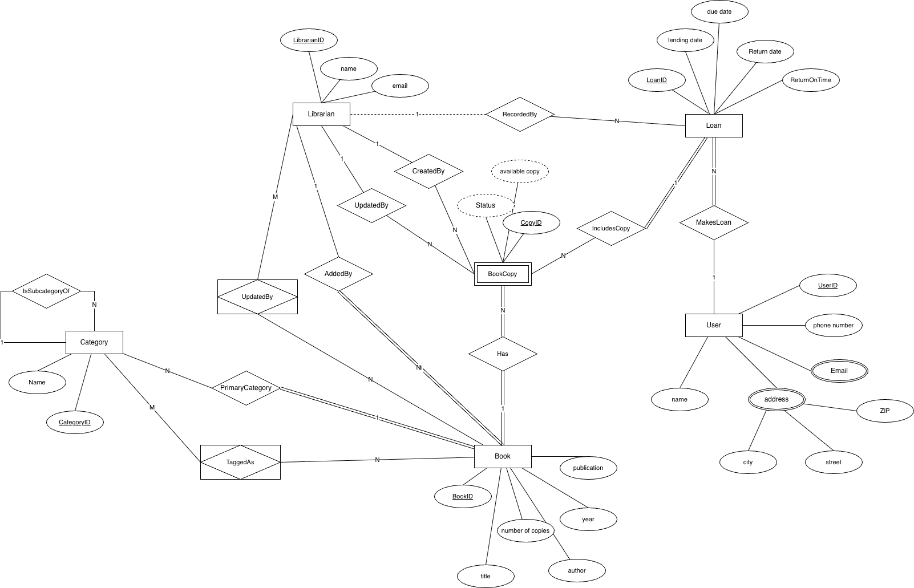
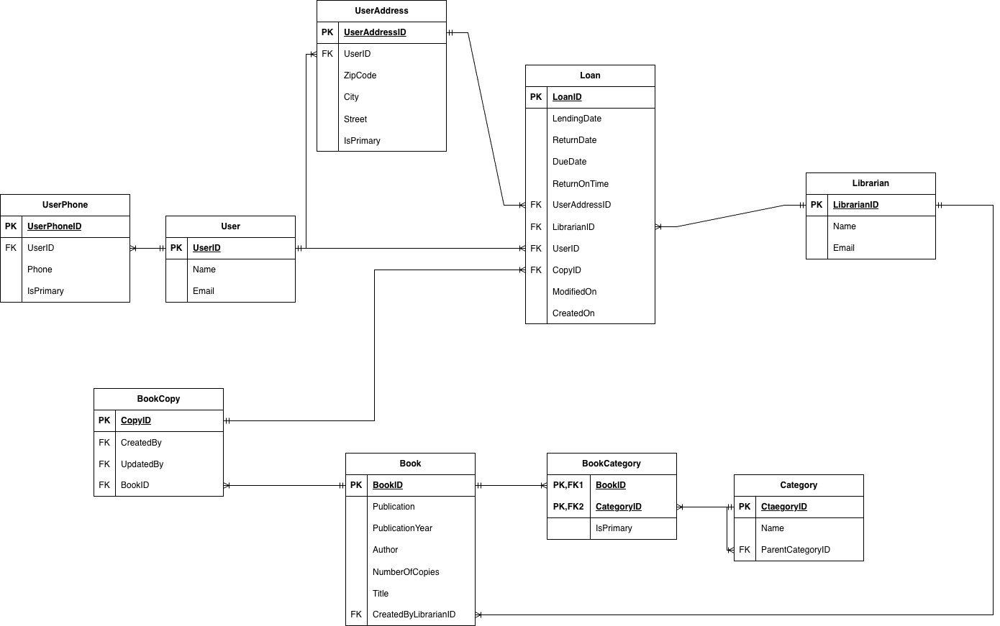
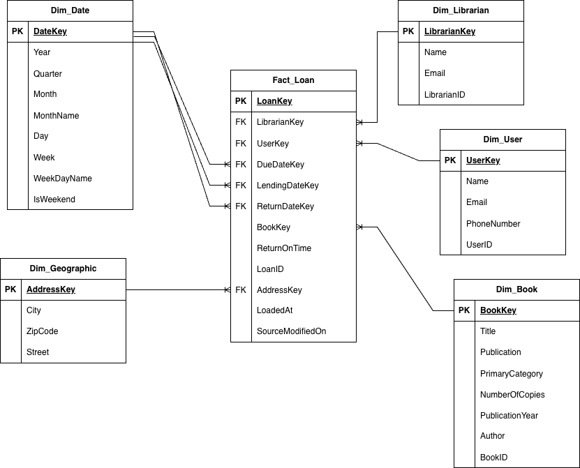

# 📚 リレーショナルデータベース設計・データモデリング プロジェクト

## 概要
本プロジェクトは、図書館管理システムを題材としたデータベース設計・データモデリングの演習プロジェクトです。
概念設計から分析用データモデル（スタースキーマ）まで、データベース設計の一連の流れを通して実装しています。

トランザクション処理向けのデータ（OLTP）を、

- リレーショナルデータベースとして適切に設計し
- 分析・レポーティングに適した形（OLAP）へ変換する

というプロセスを示すことを目的としています。
アプリケーション開発ではなく、**データベース設計・データモデリングの考え方**に焦点を当てています。

---

## プロジェクトの内容・特徴
- Chen記法による概念データモデリング
- Crow’s Foot記法による論理データモデリング
- 正規化されたリレーショナルデータベース（OLTP）
- 分析用データウェアハウス設計（スタースキーマ）
- SQLによるDDL・DML・ETLスクリプトの実装

---

## データモデリングのプロセス

### 1. 概念モデル（Chen記法）
業務要件をもとに、図書館管理システムに必要なエンティティと関係を整理しました。

**主なエンティティ**
- Book / BookCopy
- User / Librarian
- Loan
- Category

実装を意識せず、業務上の意味や関係性の整理に重点を置いています。

📌 図：`/docs/Chen_ER1.png`

---

### 2. 論理モデル（Crow’s Foot記法）
概念モデルをもとに、リレーショナルデータベースとして実装可能な論理モデルに落とし込みました。

**設計上のポイント**
- 多対多関係は中間テーブルで解消
- カテゴリは自己参照による階層構造で表現
- 電話番号・住所などの多値属性は別テーブルとして分離

📌 図：`/docs/Crows_Foot1.png`

---

### 3. 物理リレーショナルモデル（OLTP）
論理モデルをSQLで実装し、トランザクション処理向けのデータベースを構築しました。

**特徴**
- 第三正規形（3NF）まで正規化
- 主キー・外部キー制約の設定
- エンティティごとの明確なテーブル分離
- 作成日時・更新日時などの監査用カラムを追加

📌 SQLスクリプト
- `/sql/normalization/ddl.sql`（テーブル定義）
- `/sql/normalization/dml.sql`（サンプルデータ投入）

---

### 4. 分析用データモデル（スタースキーマ）
分析・レポーティングを想定し、OLTPデータをスタースキーマ構造に変換しました。

**ファクトテーブル**
- `Fact_Loan`
  - 指標：`ReturnOnTime`
  - 各ディメンションへの外部キーを保持

**ディメンションテーブル**
- `Dim_User`
- `Dim_Book`
- `Dim_Librarian`
- `Dim_Date`
- `Dim_Geographic`

これにより、以下のような分析が可能になります。
- 貸出件数の時系列分析
- 利用者の貸出傾向
- 司書ごとの業務負荷分析

📌 図：`/docs/Crows_Foot2.png`

---

## ETL・データ変換
OLTPデータから分析用データを生成するため、ETL処理をSQLで実装しています。

**処理内容**
- 正規化データの抽出
- ディメンションテーブル用のサロゲートキー生成
- タイムスタンプを用いたファクトテーブルへのデータ投入

📌 ETLスクリプト
- `/sql/etl/Timestamp_ETL.sql`

---

## 使用技術
- SQL（DDL / DML / ETL）
- リレーショナルデータベース設計
- データモデリング（Chen記法、Crow’s Foot記法）
- ディメンショナルモデリング（スタースキーマ）

---

## 実行手順
1. DDLスクリプトを実行しテーブルを作成
2. DMLスクリプトでサンプルデータを投入
3. ETLスクリプトを実行し分析用テーブルを生成
4. スタースキーマに対して分析クエリを実行

---

## 自分の担当範囲

本プロジェクトはグループワークとして進めましたが、主に以下の部分を担当しました。

- 正規化・非正規化（スタースキーマ）設計の方針整理
- 正規化モデルから分析用モデルへのETL処理の設計・実装
- 実行順を考慮したSQLスクリプトの構成整理（上から順に実行すれば再現できる形に整理）
- 実装中の細かな修正や、メンバーからの質問対応

概念設計（Chen記法）や要件整理については、メンバー全員で議論しながら進めました。
分析用のSQLクエリについては、他のメンバーが中心となって作成しています。

---

## 学習・成果ポイント
- 業務要件から概念データモデルへの落とし込み
- 正規化によるデータ整合性の確保
- 正規化モデルと非正規化モデルの使い分け
- レポーティングを意識した分析用スキーマ設計

---

## プロジェクト背景
本プロジェクトは、大学のデータベース関連科目の**グループワーク課題**として作成したものです。
授業課題としての要件に加え、**ポートフォリオとして活用できるよう内容を整理・拡張**しています。
